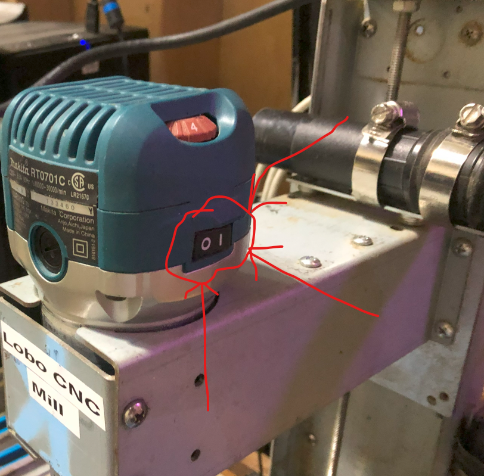
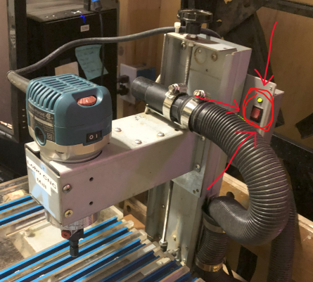

# Lobo CNC Mill  
## General Process
Ideally you came here with a general understanding of the CNC Milling process.

If not, the generic CNC milling process consists of:  
**A. Capture your design in a computer program.**  
Not addressed in this guide.  
**B. Transform your design into CNC Tool instructions.**  
Not addressed in this guide.  
**C. Setup the Tool and run the Tool Instructions.**  
The ==objective of this guide==: How to set up and run the Lobo CNC Mill. 

**The assumption is you are here with your G-code in a text file.**  

## Safety
This guide assumes you have an understanding of personal safety involving machinery. This is a loud, strong, sharp, spinning machine that may move without warning. If you have questions, concerns,or are unsure about your safety, ask someone first.  

To **STOP all mill movement**, click on the Feed Hold button, on the display.  
This **WILL NOT Stop the Router Bit** from spinning.  

To **Stop the router from spinning, turn off the router power**.  

## General/Overview
### Lobo CNC Parts
1. PC  
    1. Software  
         TBD - Location of executable
    2. Lobo Mill (Replace with a real picture of Lobo)
        1. Lobo Electronics Switch
        2. Router
            - Router Switch  
            - Router Speed  
             - Chuck  
             - Bit  
        3. Axises  
        4. Knobs  
        5. TBD  
### Electrical Connections  
TBD - Picture here
### Dimensions
TBD - X, Y, Z dimentions here

## Inputs to this process
### G-code
A text file with step-by-step instructions for the mill. This typically comes from the CAM process.

TBD- Maybe include a simple file to use? Or have a step-by-step example, with file, in the appendix?

You will need to know the following about your G-code:  
- **The units** - When the G-code was generated, either Metric or Imperial units were used. Some G-code generators will state the units used. If the file starts with “G20”, then the units are in inches. If it starts with “G21”, then the units are in millimeters.  
- **The origin of the model** - When the G-code was generated, it was relative to the origin, X=0, Y=0, Z=0. All motions and dimensions in the G-code are relative to this location. This is typically one of the top corners of the material, but may be anywhere convenient.  
- **The Bit Size & Shape**. See below under Cutting Bit.
  
### Material to Cut  
This is the stuff you want to mill your design from or into. 
> “The sculpture is already complete within the marble block… I just have to chisel away the superfluous material.” ― Michelangelo  

The material is typically foam, wood, or plastic. The Lobo Mill will struggle to simply engrave soft metals like aluminum. Attempting harder materials is a bad idea.  

### Cutting Bit  
- **Bite Type** - The bit must be appropriate for the material being cut. The wrong type can burn or melt your material or be quickly dulled by the material.  
- **Bit Size & Shape** - The G-code was generated based on this bit and if a different size or shape is used, the results will be different than intended. For example if a larger diameter mill is used, more material will be removed than specified.  

The use of multiple bits is not covered in this guide. The Lobo CNC interpreter does support multiple tools, but there is not tool changer and the changes must occur manually.  

## Assumptions  
The Lobo CNC Mill is already connected to a dedicated PC with the appropriate software installed and configured. Any connecting or configuring is beyond the scope of this simple guide.  

# Setup for the Lobo CNC Mill  
## Start the Software & Homing  

### Imperial (Inches) or Metric (Millimeters)  
There are two Icons on the PC desktop:  
- LoboCNC - Inches  
- LoboCNC - Millimeters  
Double-click the Icon for the units you wish to use.  
See the units discussion in the Inputs/G-code section above.  

### Servo Control Power  
When the software prompts you to, turn on the Servo Control Power.  

 
### Homing  
Next, the software will ask: Do you want to execute the homing process?  
With rare exceptions, answer yes to this.  

The Lobo Mill knows where it is by counting the rotations of the threaded shafts. Homing is the process where it moves to the stops of each axis (a known location)  and then zeros that count. Thus, ensuring that the count is correct.  

### Done Homing  
Once the software is done homing, the CNC Control Window will be displayed:  
(TBD CNC Control Window Here)  

## Mill Setup  
### Test Options
It is rare to get your expected results from the first run of the G-code.  There will typically be an iterative process of “dialing it in” needed. 

It is recommended to first run at least the first portion of your G-code with no bit installed, no material installed, and with the router turned off. This will allow you to watching for the mill exceeding the bed limits of your material or crashing the cutting bit into something.  

Even after you have some confidence in the G-code, it is recommended that you try the first cutting on ##Scrap Material First##.

The following is the setup instructions for using the mill. There are additional [Suggestions for Testing Your Setup] if you wish to use them. When you are ready to cut for real, repeat the instructions without those suggestions. 

### Setup the Cutting Bit and Material  
1. Install your material to be milled. [For Testing, first do not install any material. Second use scrap material to confirm results.]
   How to attach your materiel to the mill table will depend on the type of milling you are performing and is beyond the scope of this guide. In general:
Your material must be secure enough to never move while being milled. Large portions (larger than chips) being removed must not be allowed to come loose.
If held down by clamps, they must not be located where the bit will collide with them.
DO NOT mill into the mill bed. If your material will be milled all the way through, sufficient sacrificial material (spoiler board) must be used underneath.
3. Install the cutting bit into the Router. [For Testing, Leave the Bit Uninstalled]

### Zero the Location
1. Remove any cutting bit installed in the router and any material from the cutting table. With no bit and material installed, it will provide more time to react to issues and stop the mill’s motions.  
2. As if the cutting bit and material you plan to use were installed, move the mill to the approximate origin of the model using the X, Y, & Z +/- buttons on the CNC Control Window.  
(TBD CNC Control Window - X,Y,Z buttons)  
3. Zero the X, Y, & Z coordinates by clicking the "Set All" button
(TBD CNC Control Window Here)  
4. Advance Setup: You can also zero individual axes and/or ender specific offset numbers if you can't start the bit at the origin.

### Load the G-Code
1. Click the Open G-Code Button.  
3. Navigate to your G-code file and open it.  

Here is where you need to be warned that the Lobo CNC software used a "reduced G-code Instruction Set". Meaning that it only understands the "basic" G-code instructions. And unfortunately, the mill will simply ignore instructions that it does not recognize, with no caution to the user.  

The best solution to this issue is to use a CAM setting for “simpler mills”. I have had good results from CAMs that can generate code for a “Generic Linux CNC”. Baring that, you may need to ask for help or learn some G-code to alter your file.

At this point, you can watch for TBD - (Stop/Pause??) and be ready to stop the mill if it goes rogue. See the Safety section above for stopping things.  

## Test and Troubleshoot the G-Code
Space Limits
Feed Hold, Abort Motion
Single Step

Install Your Material
Hardness, Bit, Rotating speed, movement speed
TEST Your Code On SCRAP!!!
Install the Cutting Bit
Material Hardness, Rotating speed, movement speed
TEST Your Code On SCRAP!!!
Execution
Run the G-Code
Shutdown

