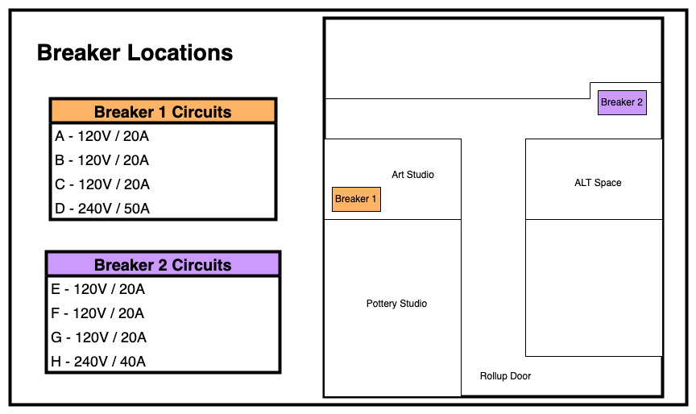

# Electrical

Our space has a fair amount of power, however, sometimes we still trip breakers. Most outlets are labeled with their corresponding circuit for easy identification. As a general principle please do not use multiple power hungry tools on any one circuit. All 120V circuits in the space are 20A.

Be mindful that the second floor has only a single 20A circuit. This was done to provide as much power as possible to the metal and wood shops.

If you do trip a breaker use the diagrams below to identify which circuit you tripped and the corresponding circuit breaker. Please do not enter other tenants spaces without asking permission. If you'd rather someone else deal with the power please send an email to the mailing list, contact the space manager, or post in the discord!

## Circuit Diagram

**Amendments:** 
- As of some time early 2024, Circuit-C is dead.
- As of some time early 2024, an additional circuit was extended to the upper level. If someone has the details, update this page or ask someone on discord to update this page.

## Breaker Locations

Neither of the two breakers are accessible without requesting access from other tenants. Please do not enter another tenants space without getting permission. The other tenants are aware that the circuit breakers are located in their spaces.

* Breaker 1 - Located in the pottery studio across the hall from the large ALTSpace interior doors
* Breaker 2 - Located behind the door directly across from the main ALTSpace interior door

## Circuit Breakers

The individual circuit breakers are labeled as "ALTSPC - *LETTER*"

### Breaker 1

### Breaker 2

