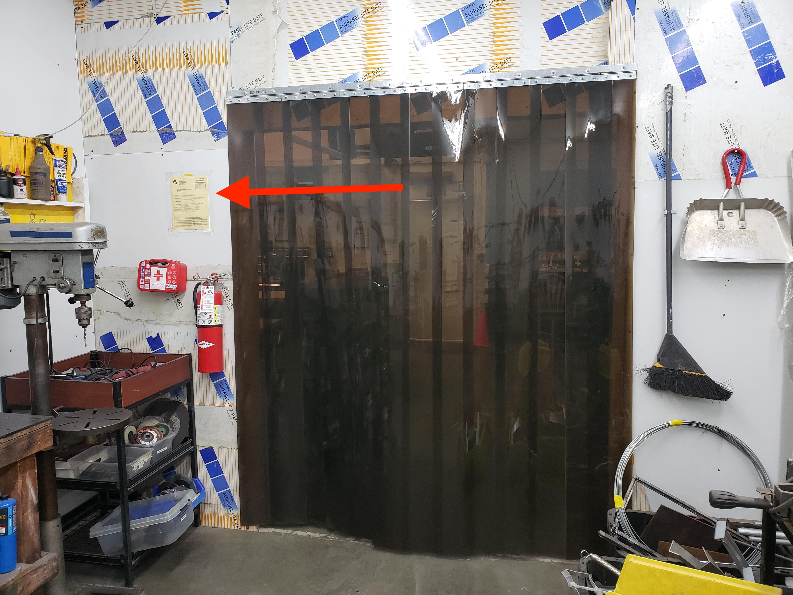

# 🔥Fire Permit and Extinguishers🧯

Some of our tools, like welding equipment and the plasma cutter, require us to
have an up to date fire permit - it's a piece of paper hanging in the metal
shop, that must be renewed annually.

As part of the permitting process, an inspector will stop by unannounced,
usually 1-2 months after the permit is renewed. Among other things, they'll be
verifying that our fire extinguishers have had their annual service. We
typically do them at the same time as the permit, but you can check the tag on
each fire extinguisher in the space to be sure.

The inspection helps make sure our space is operating safely, and also puts us
on file with the fire department, so that in case there ever _is_ a fire here,
they'll know to respond based on the specific equipment and chemicals we have.

