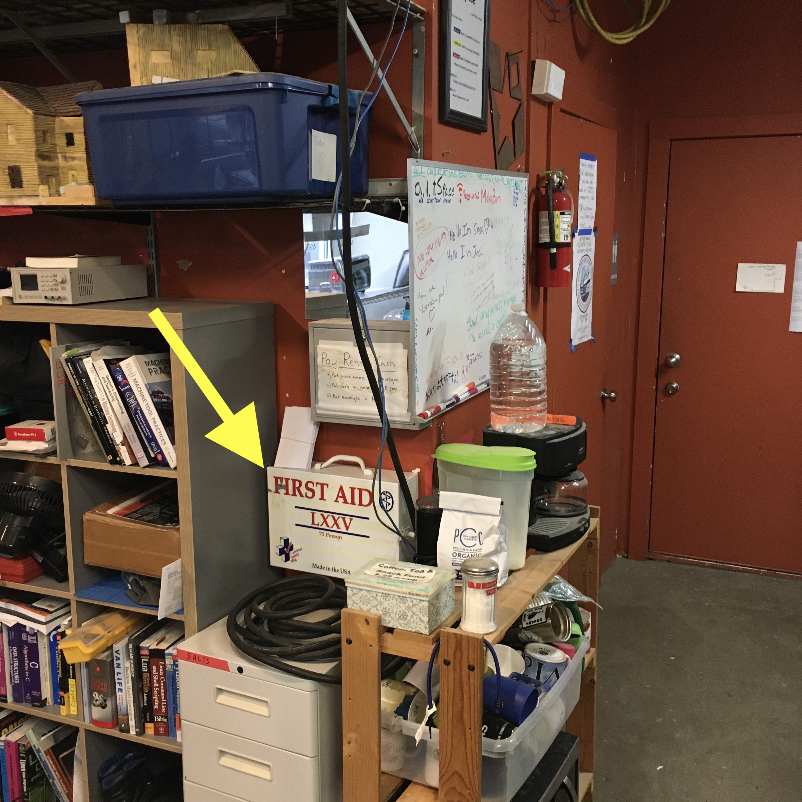

# First Aid Supplies

There is a larger first aid box in the main space with smaller ones in woodshop
and metalshop.

Each should contain (at a minimum):

- disposable sanitary gloves
- antiseptic wipes
- various sizes of bandaids
- antibiotic ointment
- ziplock bag and chemical cold pack in case of amputation 😬
- disposable splinter picker
- knuckle bandages

Additionally the larger box in the main space should have: 

- NSAID like acetaminophen, aspirin, or ibuprofen
- eye-wash
- medical tape and gauze for when band-aids won't suffice
- butterfly/wound clamping bandages: e.g. 3M Steri Strip Skin Closures 1/4" X 3"

**main space**

**woodshop**

**metalshop**

