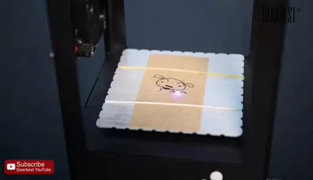

# Laser Engravers

We have two laser engravers: SpiritGX (60x95cm) and Mercury II (43x61cm).
You can etch and even cut out material if it's thin enough.

## Setup

- Protect your eyes 👀
  - Keep the lid down and don't stare at the laser while it's printing.
- Ventilation
  - The switch is by the metal shop door.
  - Ensure the ventilation blast gate for your laser cutter is open.
- Power on the laser engraver.
  - The switch for Mercury II is a little hard to find - it's on the back right corner.
- Turn on the air blower. Without it, cuts are much more likely to flame.
  - SpiritGX has a built in air compressor in the cabinet below the engraver.
    - There is a manual flow rate adjustment in the cabinet
    - Currently the compressor leaks something fierce, so only have it on while you're engraving.
  - Mercury II is connected to an external air line - open it just a bit to let air flow.
    - Close it when you're done!

## Resources

[📑 SpiritGX User Guide](/files/laserpro-spirit-gx-usersguide.pdf)

## Periodic maintenance

- clean the lens following the instructions in the user guide.
- lens must be in correct position for proper focus  
  

## Software

A special print driver is needed to operate the laser engravers.
This is already installed on the workstation connected to the engravers.

I've been using [Inkscape](https://inkscape.org) to design my prints and send them to the engravers, but there are probably other options.

## Raster vs. Vector

The laser can do two kind of printing.

### Raster Printing

During **raster** printing, the engraver will go back and forth from top to bottom, like an old inkjet printer, and pulse the laser when it's over something that needs to be etched.

This seems to be the "default" way of engraving with our print driver. e.g. if you "File > Print" from Inkscape, it will always print raster.

### Vector Printing

During **vector** printing, the engraver will follow the shape of each line as it engraves.

Vector prints are necessary for cutting out shapes, e.g. if you are making a stencil.
Even if you aren't cutting all the way through material, vector lines tend to be crisper and much faster.

However, vector prints can only be used to etch/cut very thin lines.
You can't use it for broad strokes or for filling in background - raster will be used for that.

Specifically, **the print will only attempt to vector print line widths set between 0.001" (0.025mm), 0.004" (0.1mm)**, everything else will be considered raster.

It's OK to combine raster and vectors in a single print. In the above "Keep Clear" print, the letter outlines and the border rectangle were vector cut, while the letter fill and the Moomin strokes were done raster, all in a single print job.

#### Steps for vector printing in Inkscape

Ensure your vector line strokes are set to 0.001" inch.

Go to: `Extensions >  Export > Win23 Vector Print`

This will pop up the print dialog. (🐞 It seems to always default to the SpiritGX printer, I haven't figured out how to vector print to Mercury II.)

Select "manual colors" if you'd like to specify laser parameters like power, speed, and PPI. Then adjust settings in the "Pens" tab. 
The default settings seem pretty conservative for things like etching plywood.
A good starting point might be Speed: 30, Power: 100, PPI: 1200, but plan to do some test prints to hone in on your settings.

## 🐞 Inkscape alpha crashes

There is a bug in the current stable version of Inkscape (v1.2) that prevents vector printing from working.
To work around this we are running an alpha version of Inkscape (v1.3).
Vector printing works, but the software often hangs. Presumably because it's bleeding edge. If you're reading this and a [Inkscape 1.3 or later](https://inkscape.org/release/) is out. Give it a try. If it works, update the software on the laser engraver workstation and edit this page!

